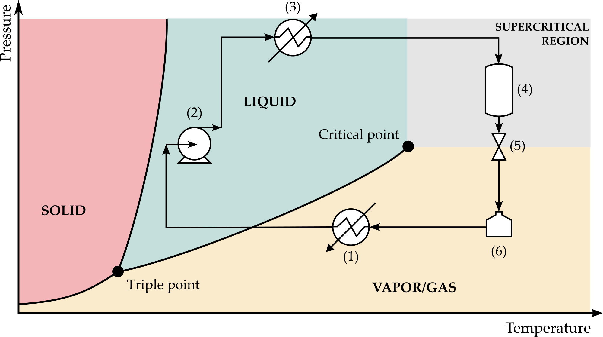

# Supercritical Fluid Extraction

## Conventional SFE process

Supercritical fluid extraction (SFE) concerns the separation of components using a supercritical fluid (SCF) as extracting agent. The application of a SCF allows the leveraging of the several advantages presented above: higher mass transfer kinetics and solvent power, lower pressure drops, easy permeation through porous matrices.

In terms of operation, the SFE comprehends four fundamental stages that are schematized in Figure 2 on top of a pressure-temperature diagram:

- Stage I: The supercritical fluid, at the desired extraction pressure and temperature conditions, goes through the extractor (vessel 4) containing the biomass (e.g., a packed bed of cork particles) and solubilizes the extractable compounds.

- Stage II: The fluid goes through a decompression valve (marked 5) to reduce pressure, while possibly being warmed by a heat exchanger (not shown). At this lower pressure, the fluid becomes a compressed gas, solubility decreases drastically, and the solutes precipitate in the collection vessel (vessel 6). The solutes are the extract stream shown in Figure 2.

- Stage III: The compressed fluid, already free of solutes, is cooled by means of a heat exchanger (marked 1) and condenses to the liquid state.

- Stage IV: The liquid is pumped by pump 2 to the desired extraction pressure (above the critical pressure). Finally, the fluid is heated by heat exchanger 3 to the operating temperature (above the critical temperature). At this point the supercritical fluid flows again through the biomass bed dissolving more solutes (Stage I). 

The process schematically shown in Figure 2 is commonly implemented at industrial scale to deal with solid biomass. Likewise, it is widely published in thousands of scientific articles in the field. The SCF must suffer a pressure drop at the extractor outlet to collect the extracted solutes and requires a recompression to be recycled to the extractor (points 6 and 2 of Figure 2, respectively). On the other hand, heating and cooling operations are also required (points 3 and 1 of Figure 2, respectively).

When the supercritical extraction ends, the whole system is depressurized to change the biomass and the solvent (i.e., CO2) returns to its storage vessel. In most cases, the solvent is stored as it is, but in some few designs it is firstly percolated through an adsorbent bed (containing activated carbon or other adsorbent) under low pressure in order to remove trace quantities of some remaining volatile compounds. In this way, the CO2 is stored very pure.

In other very few applications, during the treatment itself, an adsorbent bed is introduced in series after the decompression and collection vessel in order to refine even more the regeneration of the solvent, removing trace quantities of the persisting volatile compounds. Accordingly, the supercritical solvent leaves the extractor after crossing the biomass, the stream is depressurized to precipitate the solutes, and then percolates the adsorbent bed (at the same low pressure). At this point, the CO2 follows the common path inside the cycle (cooling, condensing, pumping, percolating biomass, etc) until the treatment cycle finishes. 

## Conventional SFE bed geometry

The conventional extraction vessel (item 4 in Figure 2) is usually of cylindrical shape and placed in a vertical orientation. It is loaded with biomass through a top opening and emptied from top or bottom opening. The biomass is transported inside a basket or bag, or moved pneumatically. The supercritical fluid typically flows upwards, however downflow is also sometimes used. This process configuration is used worldwide in industrial SFE units for the treatment of animal and vegetable biomass, being currently adopted for the removal of 2,4,6-trichloroanisole (TCA) and other off-flavors of cork by Diam.

The operating cycle of supercritical extraction processes exhibits important drawbacks, mainly in the case of biomass purifications where the content of extractable compounds is generally low. The SC-CO2 extraction of TCA and off-flavors of cork can be taken as a representative example. Briefly three items can be raised: 

- Intensive energy consumption due to the cooling and heating steps included in each cycle;

- Intensive energy consumption due to the pressure drop and recompression steps needed in each cycle;

- High capital costs due to the necessary heat exchangers, condenser, separator and pump needed inside the cycle.

Furthermore, whenever large biomass volumes are involved (as in the case of cork), big extraction vessels are necessary and additional issues appear:  

- The pressure drop along the packed bed is high, which increases pumping costs and generates non-uniformities in the bed;

- Channeling is prone to occur, giving rise to short-circuiting and reduced extraction efficiency; 

- The solutes concentration in the supercritical fluid increases along bed, which reduces the mass transfer driving force and thus the extraction efficiency. This is particularly negative in the case of trace pollutants.
