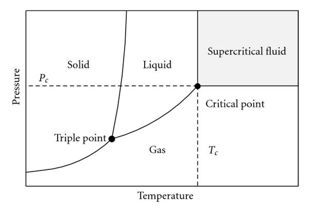
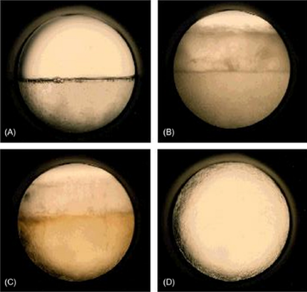

# Supercritical fluids

Mater may exist in three well-defined physical states: solid, liquid and vapor. Additionally one may consider the supercritical state, which corresponds to the region of a pressure-temperature equilibrium diagram where the fluid is simultaneously above its critical pressure and critical temperature (see figure below). When a fluid is in the supercritical state it is commonly referred to as a supercritical fluid (SCF). The critical pressure and critical temperature are characteristic of each substance and, in the case of carbon dioxide, they correspond to 73.8 bar and 31.1 °C. 

The scientific and industrial interest in supercritical fluids comes from their distinct behaviour, since they combine the best properties associated with liquids and gases/vapors. For instance, as shown in the table, supercritical fluids exhibit: 

1) high diffusivities, close to typical values of gases/vapors, which favor mass transfer velocity; 

2) low viscosities, close to those of gases/vapors, which result in lower pressure drops and higher convective mass transfer; 

3) null surface tension like gases/vapors, which allows their easy penetration into porous materials; and 

4) high densities, close to those of liquids, which increase their solvent power. 

For these reasons, supercritical fluids have been increasingly applied in extraction, chromatography, and chemical reaction processes.

| Physical property            | Vapor/Gas ($T_\text{amb}$) | Supercritical Fluid | Liquid        |
|------------------------------|------------------|---------------------|---------------|
| Density ($\text{g}/\text{cm}^3$)              | $10^{-3}$            | $0.1 - 1 $            | $1$             |
| Viscosity ($\text{Pa s}$)             | $10^{-5}$            | $10^4 - 10^5$         | $10^{-3}$        |
| Diffusivity ($\text{cm}^2/\text{s}$)          | $10^{-1}$            | $10^{-3}$               | $10^{-5} - 10^{-6}$ |
| Superficial tension ($\text{dyn}/\text{cm}$) | $-$                | $-$                   | $20 - 50$       |

The most widely applied and studied supercritical fluid is carbon dioxide, mainly because it is inert, non-toxic, non-flammable, non-explosive, and possesses an easy to reach critical point at 73.8 bar and 31.1 °C.

The properties of supercritical fluids can be significantly modified by manipulating temperature and pressure, as well as by incorporating low contents (e.g., 1-5 %) of other solvents in the mixture, which are called cosolvents or modifiers. The table below list common supercritical fluids along with their critical points and main characteristics.

| Fluid               | Chemical Formula | Critical Temperature (°C) | Critical Pressure (bar) | Main characteristics 
| ------------------- | ---------------- | ----------------------------- | --------------------------- | -------------------------------------------- |
| Carbon dioxide      | CO₂              | 31.1                          | 73.8                        | Non-flammable, low toxicity |
| Water               | H₂O              | 374.0                         | 220.6                       | Corrosive |
| Ethane              | C₂H₆             | 32.2                          | 48.7                        | Flammable |
| Propane             | C₃H₈             | 96.7                          | 42.5                        | Highly flammable |
| Methanol            | CH₃OH            | 240.9                         | 80.9                        | Flammable |
| Ethanol             | C₂H₅OH           | 240.8                         | 61.4                        | Flammable, moderately toxic |
| Toluene             | C₇H₈             | 318.6                         | 41.1                        | Highly flammable |
| Ammonia             | NH₃              | 132.4                         | 113.3                       | Flammable, toxic, corrosive |
| Nitrous oxide       | N₂O              | 36.4                          | 72.5                        | Enhances combustion of other substances |
| Sulfur hexafluoride | SF₆              | 45.6                          | 37.6                        | Potent greenhouse gas |
| Xenon               | Xe               | 16.6                          | 58.4                        | Inert noble gas, non-flammable |

