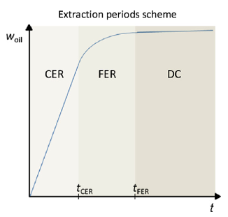

# Broken plus Intact Cells model

The Broken plus Intact Cells model (BIC) proposed by Sovová is a common way to describe extraction curves in supercritical fluid extraction, especially for plant materials.

The main idea is simple: after grinding or milling, not all cells in the solid matrix are equally accessible to the supercritical solvent. Some cells are ruptured and release solute easily, while others remain intact and release solute slowly by diffusion.

According to this model, the extraction curves are divided in three regions, each one characterized by the dominance of specific or combined mass transfer mechanisms. In this sense, the initial period is named constant extraction rate (CER), where the prevailing resistance is the external film diffusion and affects mostly accessible solutes on particles surface. 

The second period is called falling extraction rate (FER) and combines the vanishing contribution of the convective term of CER with the increasingly important intraparticle diffusion of solutes from inner intact cells. Being an intermediate region, the noticeable outcome of this period is a progressive decrease of the oil flux as the accessible solute from broken cells reaches depletion and the internal diffusion from intact cells denotes an increasing relevance for the course of the whole process. 

The final period is the one with the slowest rate because the extraction is uniquely based on the transport of solutes from intact cells through diffusion. It is known as diffusion controlled period (DC).

## Model equations

Mass balance in the SC phase:

$$
\rho_\text{f} \ \varepsilon \left( \frac{\partial y}{\partial t} + U \frac{\partial y}{\partial h} \right) = j_\text{f}
$$

Mass balance to the broken cells:

$$
g \ \rho_\text{f} (1 - \varepsilon) \frac{\partial x_1}{\partial t} = j_\text{s} = -j_\text{f}
$$

Mass balance to the intact cells:

$$
(1 - g) \ \rho_\text{s} (1 - \varepsilon) \frac{\partial x_2}{\partial t} = - j_\text{s}
$$

where:

- $y$ is the solute fluid phase concentration;
- $x_1$ and $x_2$ are the solute concentration in the broken and intact cells, respectively;
- $g$ is the grinding efficiency;
- $j_\text{s}$ is the flux from intact cells to broken cells;
- $j_\text{f}$ is the flux from broken cells to SC solvent;
- $U$ is the interstitial velocity;
- $\rho_\text{f}$ is the solvent density;
- $\rho_\text{s}$ is the solid density;
- $\varepsilon$ is the bed porosity;
- $h$ is the axial coordinate; and
- $t$ is time.

## Integrated form

The integrated form of the BIC model calculates the mass of extract ($w_\text{oil}$) produced along time, taking into account the different extraction periods.

For the constant extraction rate period, $0 \le t \le t_\text{CER}$:

$$
w_\text{oil} = Q_{\text{CO}_2} \ y_\text{oil}^* \ t \left[ 1 - \exp (-Z) \right]
$$

For the falling extraction rate period, $t_\text{CER} \le t \le t_\text{FER}$:

$$
w_\text{oil} = Q_{\text{CO}_2} \ y_\text{oil}^* \left[ t - t_\text{CER} \ \exp (Z_\text{m} - Z) \right]
$$

For the diffusion controlled period, $t \ge t_\text{FER}$:

$$
w_\text{oil} = w' \left\{ x_0 - \frac{y_\text{oil}^*}{W} \ln \left[ 1 + \left( \exp \left( \frac{W x_0}{y_\text{oil}^*} \right) - 1 \right) \exp \left( \frac{W Q_{\text{CO}_2}}{w'} (t_\text{CER} - t) \right) g \right] \right\}
$$

Complementary equations:

$$
Z_\text{m} = \frac{Z \ y_\text{oil}^*}{W \ w'} \ln \left( \frac{1}{1-g} \left[ \exp \left( \frac{W Q_{\text{CO}_2}}{w'} (t_\text{CER} - t) \right) - g \right] \right)
$$

$$
Z = \frac{k_\text{f} \ a_0 \ w' \ \rho_\text{f}}{Q_{\text{CO}_2} \ \rho_\text{b}}
$$

$$
W = \frac{w' \ k_\text{s} \ a_0}{Q_{\text{CO}_2} \ (1 - \varepsilon)}
$$

$$
t_\text{CER} = \frac{(1-g) \ w' \ x_0}{Q_{\text{CO}_2} \ y_\text{oil}^* \ Z}
$$

$$
t_\text{FER} = t_\text{CER} +  \frac{w'}{W Q_{\text{CO}_2}} \ln \left[ g + (1-g) \exp \left( \frac{W x_0}{y_\text{oil}^*} \right) \right]
$$

where:

- $t$ is the extraction time (h);
- $t_\text{CER}$ is the time when the CER period ends (h);
- $t_\text{FER}$ is the time when the FER period ends (h);
- $Q_{\text{CO}_2}$ is the mass flow rate of CO2 (kg/h);
- $y_\text{oil}^*$ is the he solute (pseudo-component) solubility;
- $w'$ is the is the mass of dry biomass in solute-free basis (kg);
- $x_0$ is the concentration of extractable target compounds in the raw material (kg/kg of biomass);
- $g$ is the fraction of broken cells;
- $\rho_\text{b}$ is the bed density (kg/m3);
- $\rho_\text{f}$ is the density of CO2 (kg/m3);
- $k_\text{f}$ is the convective mass transfer coefficient around broken cells (m/s);
- $k_\text{s}$ is the internal mass transfer coefficient for intact cells (m/s);
- $a_0$ is the specific external surface area of the biomass particles (m2/m3).

The total extraction yield ($\eta_\text{total}$, wt.%) is calculated as:

$$
\eta_\text{total} = 100 \frac{w}{w_\text{bio}}
$$

where $w_\text{bio}$ (kg) is the mass of dry biomass.